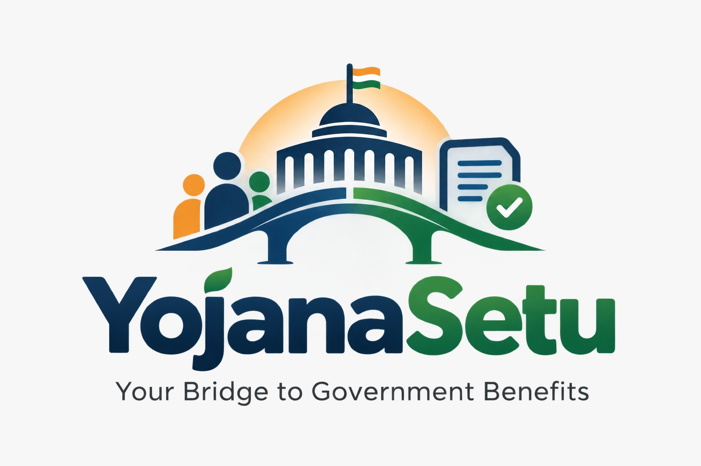
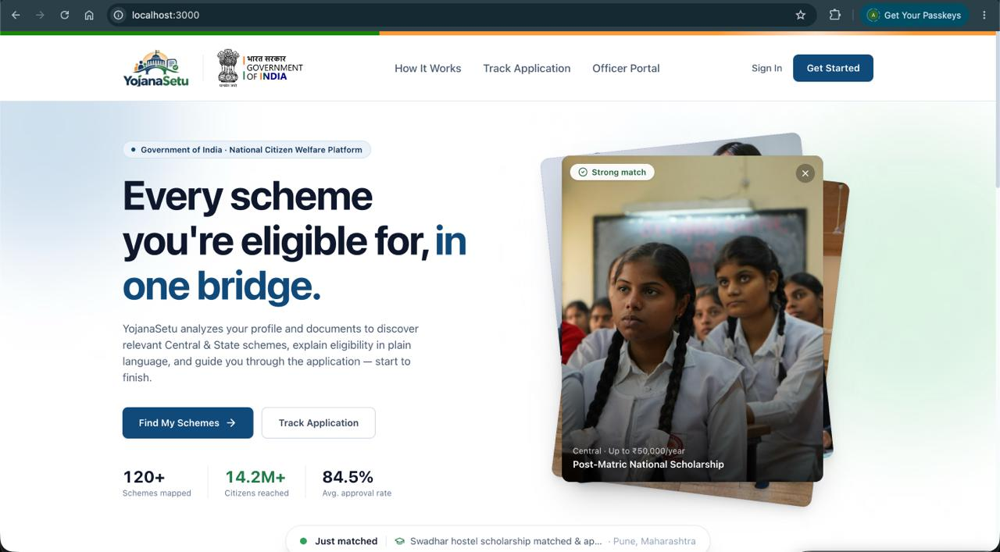

<p align="center">
  
</p>

# YojanaSetu (योजनासेतु)
### AI-Powered Government Scheme Eligibility & Benefit Assistant

> **Bridging the gap between citizens, small businesses, and government schemes through intelligent document verification, deterministic rule execution, and transparent benefit guidance.**

---

<p align="center">
  
</p>

---

## 📌 Overview

**YojanaSetu** is an AI-powered civic platform designed to help citizens and micro/small enterprises discover relevant government schemes, evaluate eligibility deterministically, compare benefits, detect missing documents, and navigate applications with evidence-backed clarity.

Navigating government social security and welfare schemes is traditionally fragmented, confusing, and documentation-heavy. YojanaSetu simplifies this process into a transparent, secure, and guided workflow.

---

## 🛑 Problem Statement

Government benefits fail to reach eligible citizens and micro-enterprises due to key hurdles:
* **Scattered Information:** Guidelines, notifications, amendments, and eligibility criteria are dispersed across hundreds of central and state government portals and PDF circulars.
* **Complex Eligibility Rules:** Intersecting age, demographic, land-holding, and income restrictions make self-assessment difficult and prone to rejection.
* **Low Awareness & Procedure Friction:** Eligible beneficiaries frequently miss welfare opportunities because of procedural complexity or lack of localized guidance.
* **Privacy & Security Vulnerabilities:** Applying requires handling high-risk personally identifiable information (Aadhaar, PAN, caste certificates, income records, and bank details) that must be rigorously protected.

---

## 💡 The YojanaSetu Solution

YojanaSetu introduces a unified, transparent, and intelligent pipeline:

```
Upload Documents / Profile
          ↓
Verify & Assess Quality (OCR + Blur/Tamper Checks)
          ↓
Find Schemes via Hybrid Search (BM25 + Vector)
          ↓
Deterministic Rule Execution (Policy-to-Code)
          ↓
Compare Benefits & Resolve Gaps
          ↓
Apply with Copilot Guidance & Track Progress
```

The platform combines document intelligence, an authoritative scheme repository, hybrid retrieval, rule-based eligibility evaluation, and interactive multi-channel assistance (Web, Mobile, and IVR).

---

## 🏛️ High-Level System Architecture

```
                       ┌──────────────────────────────┐
                       │     Applicant / Citizen      │
                       └──────────────┬───────────────┘
                                      │
                                      ▼
                        [ Profile & Document Upload ]
                                      │
                                      ▼
               ┌──────────────────────────────────────────────┐
               │    Document Intelligence & Verification      │
               │   • PyMuPDF / PaddleOCR  • Blur Detection   │
               │   • Field Extraction     • Contradictions    │
               └──────────────────────┬───────────────────────┘
                                      │
                                      ▼
                         [ Verified Citizen Profile ]
                                      │
                                      ▼
               ┌──────────────────────────────────────────────┐
               │        Hybrid Retrieval & Reranking          │
               │  • BM25 Keyword Search  • pgvector Semantic  │
               │  • Metadata Filtering   • Cross-Encoder Rerank│
               └──────────────────────┬───────────────────────┘
                                      │
                                      ▼
               ┌──────────────────────────────────────────────┐
               │       Policy → Rule Compilation Engine       │
               │   Machine-readable conditions linked to      │
               │   official source PDFs, clauses & page #s    │
               └──────────────────────┬───────────────────────┘
                                      │
                                      ▼
               ┌──────────────────────────────────────────────┐
               │         Deterministic Decision Engine        │
               └──────┬───────────────┼───────────────┬───────┘
                      │               │               │
                      ▼               ▼               ▼
                 [ Eligible ]  [ Manual Review ] [ Ineligible ]
                      │               │
                      ▼               ▼
               ┌──────────────────────────────────────────────┐
               │      Benefit Comparison & Gap Detection      │
               │  • Scheme Comparison    • Missing Documents  │
               └──────────────────────┬───────────────────────┘
                                      │
                                      ▼
               ┌──────────────────────────────────────────────┐
               │              YojanaSetu Copilot              │
               │  • Step-by-Step Help    • Explanations       │
               │  • Video Guides         • IVR Voice Channel  │
               └──────────────────────┬───────────────────────┘
                                      │
                                      ▼
                       [ Application Tracking & Status ]
```

---

## 🧠 Hybrid AI & Deterministic Reasoning Workflow

YojanaSetu maintains a strict boundary between probabilistic AI (for unstructured document parsing and semantic retrieval) and deterministic rule execution (for eligibility decisions).

```
Government Circulars / Gazette Notifications
                  ↓
          Document Processing
                  ↓
       Chunking & Structural Metadata
                  ↓
     Embeddings + Keyword Inverted Index
                  ↓
         Hybrid Retrieval (RAG)
                  ↓
          Cross-Encoder Rerank
                  ↓
        Relevant Policy Evidence
                  ↓
     LLM Policy Translation (Compiler)
                  ↓
     Structured, Auditable Rules (JSON)
                  ↓
          Rule Engine Execution
```

> **Why this matters:** AI is leveraged for what it excels at (reading complex documents, extracting text, finding semantic matches, answering conversational questions), while formal eligibility outcomes are determined by verifiable, deterministic code rules.

---

## ✨ Core Features

### 1. Document Intelligence & Pre-verification
* **OCR & Field Extraction:** PyMuPDF for native PDF text extraction, PaddleOCR for scanned forms and identity proofs, and Gemini vision-language capabilities for canonical field normalization.
* **Image Quality Assessment:** Real-time variance-of-Laplacian blur scoring (`<100` Blurry, `100–500` Borderline, `>=500` Sharp) and minimum resolution checks (`1000px × 700px`).
* **Contradiction Detection:** Cross-compares extracted details across identity records (Aadhaar, PAN, Ration card, Income certificates) with profile data to flag mismatches prior to application.

### 2. Consent-Based DigiLocker Integration
* Direct retrieval of verified digital documents via authorized DigiLocker APIs, reducing paper submissions and eliminating document tampering risks.

### 3. Structured Government Scheme Knowledge Base
* Standardized metadata schema encompassing:
  * Scheme name, code, ministry, and funding pattern (Central/State/Centrally Sponsored).
  * Target beneficiaries, demographic/geographical quotas, and caste/economic limits.
  * Quantitative benefits (direct transfers, subsidies, soft loans, scholarships).
  * Mandatory vs. alternative documents and procedural milestones.
  * Exact legal citations: Official Gazette/circular title, section, page number, and revision date.

### 4. Hybrid Retrieval Architecture
* **Dual Indexing:** Combines inverted index keyword matching (BM25) with vector embeddings (`pgvector`) for precise legal term matching and broad semantic intent discovery.
* **Context Reranking:** Cross-encoder rerankers prioritize schemes matching specific applicant socioeconomic attributes.

### 5. Policy-to-Executable Rules
* Translates legal eligibility text into machine-executable schema:
  ```json
  {
    "rule_id": "PMAY_URBAN_INC_01",
    "condition": "annual_income <= 300000",
    "target_category": "EWS",
    "source": "pmay_u_guidelines_2024.pdf",
    "page": 14,
    "clause": "3.1.2",
    "status": "verified"
  }
  ```

### 6. Evidence-Based Decision Trail
* Every evaluation outcome is accompanied by a transparent provenance graph:
  $$\text{Applicant Fact} \longrightarrow \text{Eligibility Rule} \longrightarrow \text{Government Circular} \longrightarrow \text{Page / Section} \longrightarrow \text{Verdict}$$

### 7. Three-Tier Eligibility Outcomes
To protect applicants from hallucinated verdicts:
* **Eligible:** All mandatory requirements confirmed against verified documents.
* **Ineligible:** Definitive conflict with explicit criteria (with cited rule and rationale).
* **Manual Review / Borderline:** Ambiguous criteria, low-confidence OCR, borderline income brackets, or conflicting records routed for expert evaluation.

### 8. Side-by-Side Benefit Comparison
* Matrix comparisons of potential subsidies, interest subventions, tenure, recurring payouts, and documentation burden across overlapping schemes.

### 9. Missing Document & Gap Detector
* Pinpoints exact document deficiencies and explains *why* the certifying document is legally necessary according to scheme guidelines.

### 10. YojanaSetu Copilot
* Multilingual conversational assistant offering step-by-step guidance, localized video walkthroughs, and form-filling tips.

### 11. End-to-End Application Tracking
* Lifecycle timeline monitoring application progress, official objections, and query responses.

### 12. Public Administration & Impact Analytics
* Administrative intelligence dashboards visualizing scheme utilization, regional uptake, and underserved geographic pockets.

### 13. Inclusive Multimodal Access (IVR & Voice)
* Interactive Voice Response (IVR) phone interface allowing non-smartphone users and rural populations to check eligibility via spoken regional languages.

---

## ⚖️ What Sets YojanaSetu Apart

| Feature | Traditional Portals / Simple RAG | YojanaSetu Approach |
| :--- | :--- | :--- |
| **Verification** | Assumes user input is valid | **Verify Before Reason:** Rigorous OCR quality and fraud checks |
| **Decision Integrity** | Hallucination-prone probabilistic LLM answers | **Deterministic Execution:** Policy converted to auditable code rules |
| **Transparency** | Generic summary text | **Traceable Citations:** Line, clause, and official PDF page references |
| **Edge Cases** | Forces arbitrary Yes/No decisions | **Three-Tier Triaging:** Flags borderline cases for human/manual review |
| **Actionability** | Stops at search results | **Actionable Roadmap:** Benefit comparison, missing document guidance, and tracking |
| **Accessibility** | Web-only text interfaces | **Omnichannel:** Web, mobile-first responsive, and IVR voice support |

---

## 🔒 Security & Privacy (Privacy-by-Design)

YojanaSetu enforces strict data protection controls tailored for sensitive citizen records:

* **End-to-End Encryption:** TLS 1.3 in transit and AES-256 encryption at rest for stored documents and identity records.
* **Data Minimization:** Only information essential for scheme verification is collected and processed.
* **Privacy-Aware AI:** Automated redaction and masking of high-risk identifiers (e.g., masking Aadhaar numbers) before passing data to language models.
* **Role-Based Access Control (RBAC):** Strict segregation of privileges across citizens, caseworkers, and administrators.
* **Audit Logging:** Tamper-evident logging of all document interactions, eligibility queries, and administrative updates.
* **Consent & Retention:** Zero unsolicited sharing; user-consented DigiLocker access with configurable data retention and user-triggered deletion.

---

## 🛠️ Technology Stack

| Layer | Technologies |
| :--- | :--- |
| **Frontend** | React 19, Vite, Tailwind CSS v4, Motion, Lucide React, Recharts |
| **Backend API** | Node.js, Express, TypeScript, Supabase JS |
| **Database & Auth** | PostgreSQL, `pgvector`, Supabase Auth & Storage, Row Level Security (RLS) |
| **Document Processing & OCR** | Python 3.11+, PyMuPDF, PaddleOCR, OpenCV (variance of Laplacian blur check) |
| **AI / LLMs & Reranking** | Google Gemini (`@google/genai`), Cross-Encoder Reranking, BM25 + Vector Hybrid Retrieval |
| **Voice & Integrations** | DigiLocker APIs, IVR Telephony Services |

---

## 📁 Repository Structure

```
YojanaSetu/
├── client/                     # Frontend web application (React + Vite + Tailwind CSS)
│   ├── src/
│   │   ├── components/         # Shared UI components
│   │   ├── features/           # Feature-specific workflows (Schemes, Documents, Eligibility)
│   │   ├── pages/              # Primary application routes
│   │   └── lib/                # Client utilities & Supabase client
│   └── package.json
├── server/                     # Backend API & Document processing
│   ├── src/
│   │   ├── index.ts            # Express server entry point
│   │   ├── routes/             # REST endpoints (auth, schemes, documents, analytics)
│   │   ├── middleware/         # Auth verification & RBAC
│   │   └── lib/                # Business logic & profile/document analysis
│   ├── ocr-service/            # Python document intelligence microservice
│   │   ├── app/                # PaddleOCR & PyMuPDF processing pipeline
│   │   ├── requirements.txt    # Python dependencies
│   │   └── run.py              # OCR service server (FastAPI/Flask)
│   ├── supabase/
│   │   ├── schema.sql          # Database tables, triggers, and RLS definitions
│   │   └── seed.sql            # Reference schemes and analytics datasets
│   └── package.json
├── package.json                # Monorepo orchestration scripts
└── README.md
```

---

## 🚀 Getting Started

### Prerequisites
* **Node.js** (v18.x or v20.x+)
* **Python** (v3.10 - v3.13 for PaddleOCR compatibility)
* **Supabase Account** (or self-hosted Supabase instance)

### 1. Database & Authentication Setup
1. Create a project in [Supabase](https://supabase.com).
2. Open the Supabase **SQL Editor** and run `server/supabase/schema.sql`.
3. Run `server/supabase/seed.sql` to populate initial government schemes and district analytics.
4. From your Supabase project settings, retrieve your `Project URL`, `anon public key`, and `service_role key`.

### 2. Environment Configuration

#### Server Setup
```bash
cd server
cp .env.example .env
```
Populate `server/.env`:
```env
PORT=4000
SUPABASE_URL=https://<your-project>.supabase.co
SUPABASE_SERVICE_ROLE_KEY=<your-service-role-key>
OCR_SERVICE_URL=http://127.0.0.1:8001
OCR_SERVICE_TOKEN=your-internal-service-token
```

#### Client Setup
```bash
cd ../client
cp .env.example .env
```
Populate `client/.env`:
```env
VITE_SUPABASE_URL=https://<your-project>.supabase.co
VITE_SUPABASE_ANON_KEY=<your-anon-public-key>
VITE_API_URL=http://localhost:4000
```

### 3. (Optional) Run Python OCR Service
```bash
cd server/ocr-service
python -m venv .venv
# Activate virtualenv (Windows: .venv\Scripts\activate | Unix: source .venv/bin/activate)
pip install -r requirements.txt
cp .env.example .env
# Set GEMINI_API_KEY and OCR_SERVICE_TOKEN
python run.py
```
*The OCR service runs on `http://127.0.0.1:8001`.*

### 4. Install & Launch the Full Stack
From the project root:
```bash
# Install dependencies across client and server
npm run install:all

# Run API server and Vite client concurrently
npm run dev
```

* **Client:** `http://localhost:3000`
* **API Server:** `http://localhost:4000`
* **Health Check:** `http://localhost:4000/api/health`

---

## 📄 License

This project is licensed under the terms specified in the [LICENSE](LICENSE) file.
